# DR-Tulu Agent Architecture Diagrams

This document contains comprehensive Mermaid diagrams illustrating the DR-Tulu deep research agent architecture.

## Table of Contents

1. [Overall Architecture Overview](#1-overall-architecture-overview)
2. [ReAct Agent Loop Flow](#2-react-agent-loop-flow)
3. [Tool Registration & Execution Flow](#3-tool-registration--execution-flow)
4. [MCP Communication Pattern](#4-mcp-communication-pattern)
5. [Configuration Loading Process](#5-configuration-loading-process)
6. [Tool Parser Hierarchy](#6-tool-parser-hierarchy)
7. [Component Class Diagram](#7-component-class-diagram)
8. [Data Flow Sequence](#8-data-flow-sequence)

---

## 1. Overall Architecture Overview

This diagram shows the high-level architecture of the DR-Tulu agent system.

---

## 2. ReAct Agent Loop Flow

This diagram illustrates the core ReAct (Reasoning + Acting) loop implemented in `LLMToolClient.generate_with_tools()`.

```mermaid
flowchart TD
    Start([Start Query]) --> Init["Initialize<br/>• message_history = []<br/>• iteration = 0<br/>• max_iterations = 20"]
    
    Init --> BuildPrompt["Build System Prompt<br/>+ Tool Descriptions"]
    
    BuildPrompt --> LLMCall["🧠 LLM Generate<br/>get_litellm_response()"]
    
    LLMCall --> ParseResponse{"Parse Response<br/>for Tool Calls"}
    
    ParseResponse -->|"Tool Call Found<br/>(parser mode)"| ExtractTool["Extract Tool Call<br/>via ToolCallParser"]
    ParseResponse -->|"Tool Call Found<br/>(native mode)"| NativeExtract["Extract from<br/>tool_calls field"]
    ParseResponse -->|"No Tool Call"| CheckStop{"Check Stop<br/>Conditions"}
    
    ExtractTool --> ExecuteTool["🛠️ Execute Tool<br/>tool.execute()"]
    NativeExtract --> ExecuteTool
    
    ExecuteTool --> FormatResult["Format Tool Result<br/>as Message"]
    
    FormatResult --> AppendHistory["Append to<br/>message_history"]
    
    AppendHistory --> IncrementIter["iteration += 1"]
    
    IncrementIter --> CheckIter{"iteration ≥<br/>max_iterations?"}
    
    CheckIter -->|Yes| ForceStop["Force Stop<br/>Return Last Response"]
    CheckIter -->|No| LLMCall
    
    CheckStop -->|"<answer> tag found"| ExtractAnswer["Extract Answer<br/>from tags"]
    CheckStop -->|"Conclusion marker found"| ExtractAnswer
    CheckStop -->|"Max tokens reached"| ForceStop
    CheckStop -->|"Continue"| LLMCall
    
    ExtractAnswer --> End([Return Final Answer])
    ForceStop --> End

    style LLMCall fill:#e1f5fe
    style ExecuteTool fill:#fff3e0
    style ExtractAnswer fill:#e8f5e9
```

---

## 3. Tool Registration & Execution Flow

This diagram shows how tools are registered and executed within the agent system.

```mermaid
flowchart TD
    subgraph Registration["Tool Registration Phase"]
        WFInit["Workflow.__init__()"] --> LoadConfig["Load YAML Config"]
        LoadConfig --> CreateTools["Create Tool Instances"]
        
        CreateTools --> MCPSearch["MCPSearchTool<br/>• serper_web_search<br/>• exa_search<br/>• semantic_scholar_search"]
        CreateTools --> MCPBrowse["MCPBrowseTool<br/>• jina_read_url<br/>• crawl4ai_scrape"]
        CreateTools --> Chained["ChainedTool<br/>(Optional)"]
        
        MCPSearch --> RegisterClient["Register with<br/>LLMToolClient"]
        MCPBrowse --> RegisterClient
        Chained --> RegisterClient
        
        RegisterClient --> BuildSchema["Build Tool Schema<br/>for LLM"]
    end

    subgraph Execution["Tool Execution Phase"]
        ToolCall["Tool Call Detected"] --> ParseArgs["Parse Arguments<br/>from XML/JSON"]
        
        ParseArgs --> Lookup["Lookup Tool<br/>by Name"]
        
        Lookup --> ValidateArgs["Validate Arguments<br/>against Schema"]
        
        ValidateArgs -->|Valid| Execute["tool.execute(**args)"]
        ValidateArgs -->|Invalid| Error["Return Error Message"]
        
        Execute --> MCPTransport{"Transport Type?"}
        
        MCPTransport -->|HTTP| HTTPCall["HTTP Request to<br/>MCP Server"]
        MCPTransport -->|In-Memory| DirectCall["Direct FastMCP<br/>Function Call"]
        
        HTTPCall --> ExternalAPI["External API<br/>(Serper/Exa/etc.)"]
        DirectCall --> ExternalAPI
        
        ExternalAPI --> FormatResponse["Format Response<br/>as Tool Result"]
        
        FormatResponse --> ReturnToAgent["Return to Agent<br/>for Next Iteration"]
    end

    BuildSchema -.->|"At Runtime"| ToolCall

    style Registration fill:#e3f2fd
    style Execution fill:#fff8e1
```

---

## 4. MCP Communication Pattern

This diagram illustrates the Model Context Protocol (MCP) communication architecture.

---

## 5. Configuration Loading Process

This diagram shows how configuration flows from YAML files through to runtime objects.

```mermaid
flowchart TD
    subgraph YAMLFiles["YAML Configuration Files"]
        Basic["auto_search_basic.yaml"]
        Deep["auto_search_deep.yaml"]
        Parallax["auto_search_parallax.yaml"]
        Custom["Custom *.yaml"]
    end

    subgraph Loading["Configuration Loading"]
        CLI["CLI Arguments<br/>--config path"] --> ResolvePath["Resolve Config Path"]
        ResolvePath --> OmegaConf["OmegaConf.load()"]
        
        Basic --> OmegaConf
        Deep --> OmegaConf
        Parallax --> OmegaConf
        Custom --> OmegaConf
        
        OmegaConf --> Merge["Merge with CLI Overrides"]
        Merge --> DictConfig["DictConfig Object"]
    end

    subgraph ConfigSections["Configuration Sections"]
        DictConfig --> LLMConfig["llm_config:<br/>• model<br/>• api_base<br/>• temperature"]
        DictConfig --> ToolConfig["tool_config:<br/>• mcp_endpoint<br/>• search_tools<br/>• browse_tools"]
        DictConfig --> AgentConfig["agent_config:<br/>• max_iterations<br/>• tool_calling_mode<br/>• tool_parser"]
        DictConfig --> PromptConfig["prompt_config:<br/>• system_prompt_file<br/>• tool_prompt_file"]
    end

    subgraph Runtime["Runtime Objects"]
        LLMConfig --> ClientInit["LLMToolClient()<br/>initialization"]
        ToolConfig --> ToolInit["Tool Registration"]
        AgentConfig --> LoopConfig["ReAct Loop<br/>Parameters"]
        PromptConfig --> PromptLoad["Load Prompt<br/>Templates"]
        
        ClientInit --> Workflow["Configured Workflow"]
        ToolInit --> Workflow
        LoopConfig --> Workflow
        PromptLoad --> Workflow
    end

    style YAMLFiles fill:#e1f5fe
    style Loading fill:#f3e5f5
    style ConfigSections fill:#e8f5e9
    style Runtime fill:#fff8e1
```

---

## 6. Tool Parser Hierarchy

This diagram shows the tool parser class hierarchy and parsing strategies.

---

## 7. Component Class Diagram

This diagram shows the main classes and their relationships.

---

## 8. Data Flow Sequence

This sequence diagram shows the complete data flow for a research query.

---

## Key Architecture Insights

### ReAct Loop Implementation
- Located in `LLMToolClient.generate_with_tools()` at `dr_agent/client.py:539-1521`
- Maximum 20 iterations by default
- Stops on `<answer>` tags, conclusion markers, or iteration limit

### Tool Calling Modes
1. **Parser Mode**: XML pattern detection using configurable parsers
2. **Native Mode**: OpenAI function calling format

### MCP Transport Options
1. **HTTP Transport**: `StreamableHttpTransport` for remote MCP servers
2. **In-Memory Transport**: `FastMCPTransport` for co-located servers

### Default Parser
- `v20250824` format: `<call_tool name="tool_name">arguments</call_tool>`

### Stop Conditions
1. `<answer>` tag detected in response
2. Conclusion markers (e.g., "## Conclusion", "Final Answer")
3. Maximum tool calls reached
4. Token limit exceeded
5. Iteration limit (20) reached

---

## File References

| Component | File Path |
|-----------|-----------|
| Main Client | `dr_agent/client.py` |
| Workflow Base | `dr_agent/workflow.py` |
| Agent Interface | `dr_agent/agent_interface.py` |
| Tool Base | `dr_agent/tool_interface/base.py` |
| MCP Tools | `dr_agent/tool_interface/mcp_tools.py` |
| Tool Parsers | `dr_agent/tool_interface/tool_parsers.py` |
| MCP Backend | `dr_agent/mcp_backend/main.py` |
| System Prompts | `dr_agent/shared_prompts/unified_tool_calling.py` |
| Auto Search Workflow | `workflows/auto_search_sft.py` |
| Config Examples | `workflows/*.yaml` |
